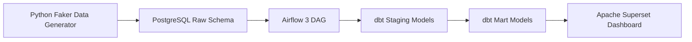
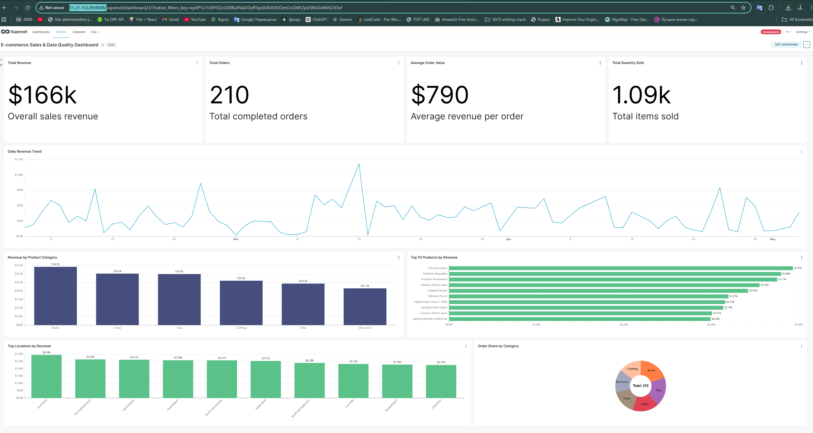
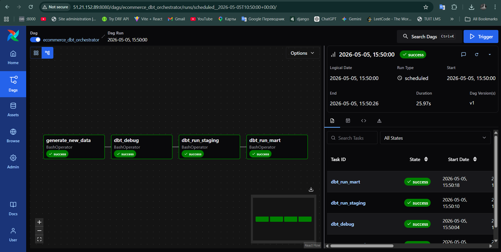

# E-commerce Data Analytics Pipeline

End-to-end e-commerce data engineering and analytics project built with **Apache Airflow 3**, **dbt**, **PostgreSQL**, **Apache Superset**, and **Docker Compose**.

This project generates synthetic e-commerce data, stores it in PostgreSQL, transforms raw data into analytics-ready models with dbt, orchestrates the workflow with Airflow, and visualizes business KPIs in Superset.

---

## Project Overview

The goal of this project is to demonstrate a complete modern data pipeline from raw data generation to dashboard visualization.

The pipeline includes:

* Synthetic e-commerce data generation using Python and Faker
* Raw data storage in PostgreSQL
* Data cleaning and transformation using dbt
* Workflow orchestration using Apache Airflow 3
* Dashboard visualization using Apache Superset
* Local and cloud deployment using Docker Compose
* AWS EC2 deployment

---

## Tech Stack

| Tool             | Purpose                         |
| ---------------- | ------------------------------- |
| Python           | Synthetic data generation       |
| Faker            | Fake e-commerce data generation |
| PostgreSQL       | Data warehouse                  |
| Apache Airflow 3 | Pipeline orchestration          |
| dbt              | Data transformation             |
| Apache Superset  | Dashboard and visualization     |
| Docker Compose   | Multi-container orchestration   |
| AWS EC2          | Cloud deployment                |

---

## Architecture



---

## Pipeline Flow

The Airflow DAG runs the pipeline in this order:

```text
generate_new_data -> dbt_debug -> dbt_run_staging -> dbt_run_mart
```

### 1. Data Generation

The Python data generator creates synthetic e-commerce records for:

* Customers
* Products
* Orders

Some dirty records are intentionally generated, such as:

* Invalid emails
* Negative prices
* Invalid quantities
* Outlier product prices
* Messy category values

This makes the project more realistic because real-world data is rarely clean.

### 2. Raw Data Storage

Generated data is stored in PostgreSQL under the `raw` schema.

Raw tables:

```text
raw.customers
raw.products
raw.orders
```

### 3. dbt Staging Models

dbt staging models clean and standardize the raw data.

Staging models:

```text
analytics.stg_customers
analytics.stg_products
analytics.stg_orders
```

Examples of cleaning logic:

* Trim customer names
* Normalize product category names
* Convert invalid categories to `Other`
* Remove extreme product price outliers
* Convert negative prices to positive values
* Fix invalid order quantities

### 4. dbt Mart Models

Mart models create analytics-ready datasets for reporting and dashboarding.

Mart models:

```text
analytics.mart_sales_detail
analytics.mart_sales_summary
```

`mart_sales_detail` contains detailed order-level sales data.

`mart_sales_summary` contains aggregated sales metrics by product category.

### 5. Superset Dashboard

Apache Superset connects to PostgreSQL and visualizes the final analytics tables.

The dashboard includes:

* Total Revenue
* Total Orders
* Average Order Value
* Total Quantity Sold
* Daily Revenue Trend
* Revenue by Product Category
* Top 10 Products by Revenue
* Top Locations by Revenue
* Order Share by Category

---

## Project Structure

```text
e-commerce-data-analytics/
│
├── airflow/
│   ├── dags/
│   │   └── orchestrator.py
│   └── logs/
│
├── data_generation/
│   ├── data_generator.py
│   └── insert_records.py
│
├── ecommerce_dbt/
│   ├── dbt_project.yml
│   ├── models/
│   │   ├── sources/
│   │   │   └── sources.yml
│   │   ├── staging/
│   │   │   ├── stg_customers.sql
│   │   │   ├── stg_orders.sql
│   │   │   └── stg_products.sql
│   │   └── mart/
│   │       ├── mart_sales_detail.sql
│   │       └── mart_sales_summary.sql
│   ├── macros/
│   ├── seeds/
│   ├── snapshots/
│   └── tests/
│
├── postgres/
│   └── airflow_init.sql
│
├── docker/
│   ├── docker-bootstrap.sh
│   ├── docker-init.sh
│   ├── superset_config.py
│   └── .env.example
│
├── docs/
│   └── images/
│       ├── superset-dashboard.png
│       └── airflow-dag-success.png
│
├── Dockerfile
├── docker-compose.yaml
├── .gitignore
└── README.md
```

---

## Airflow DAG

The main DAG is located at:

```text
airflow/dags/orchestrator.py
```

DAG tasks:

| Task                | Description                                |
| ------------------- | ------------------------------------------ |
| `generate_new_data` | Generates new raw e-commerce data          |
| `dbt_debug`         | Checks dbt project and database connection |
| `dbt_run_staging`   | Runs dbt staging models                    |
| `dbt_run_mart`      | Runs dbt mart models                       |

DAG schedule:

```text
*/5 * * * *
```

The pipeline runs every 5 minutes.

---

## Superset Dashboard Preview

### Executive Dashboard

The Superset dashboard provides a high-level overview of e-commerce performance.



### Airflow DAG Success Run

The Airflow DAG successfully orchestrates the full pipeline.



---

## How to Run Locally

### 1. Clone the repository

```bash
git clone https://github.com/najmiddinov-code/e-commerce-data-analytics.git
cd e-commerce-data-analytics
```

### 2. Create dbt profile

Create a dbt profile file:

```bash
mkdir -p ~/.dbt
nano ~/.dbt/profiles.yml
```

Add this configuration:

```yaml
ecommerce_dbt:
  target: dev
  outputs:
    dev:
      type: postgres
      host: db
      user: db_user
      password: db_password
      port: 5432
      dbname: db
      schema: analytics
      threads: 4
```

### 3. Create Superset environment file

Create the Superset environment file:

```bash
mkdir -p docker
nano docker/.env
```

Example configuration:

```env
DATABASE_DB=superset
DATABASE_HOST=db
DATABASE_PASSWORD=superset
DATABASE_USER=superset
DATABASE_PORT=5432
DATABASE_DIALECT=postgresql+psycopg2

POSTGRES_DB=superset_db
POSTGRES_USER=superset
POSTGRES_PASSWORD=superset
POSTGRES_PORT=5432

REDIS_HOST=redis
REDIS_PORT=6379

SUPERSET_SECRET_KEY=TEST_NON_DEV_SECRET
SUPERSET_ENV=development
SUPERSET_LOAD_EXAMPLES=no
SUPERSET_LOG_LEVEL=info
SUPERSET_PORT=8088
```

### 4. Start all services

```bash
docker compose -f docker-compose.yaml up -d --build
```

### 5. Check running containers

```bash
docker ps
```

Expected services:

```text
postgres_ecommerce_container
airflow_api_server_ecommerce_container
airflow_scheduler_ecommerce_container
airflow_dag_processor_ecommerce_container
airflow_triggerer_ecommerce_container
superset_ecommerce_app
redis
```

---

## Service URLs

| Service     | URL                                            |
| ----------- | ---------------------------------------------- |
| Airflow UI  | [http://localhost:8080](http://localhost:8080) |
| Superset UI | [http://localhost:8088](http://localhost:8088) |
| PostgreSQL  | localhost:5432                                 |

---

## Superset Database Connection

In Superset, create a PostgreSQL database connection using:

```text
HOST: db
PORT: 5432
DATABASE NAME: db
USERNAME: db_user
PASSWORD: db_password
DISPLAY NAME: PostgreSQL
```

Then create datasets from:

```text
analytics.mart_sales_detail
analytics.mart_sales_summary
analytics.stg_customers
analytics.stg_orders
analytics.stg_products
```

---

## AWS Deployment

This project was also deployed on AWS using an EC2 Ubuntu instance.

AWS deployment stack:

* AWS EC2 Ubuntu
* Docker Compose
* PostgreSQL container
* Airflow 3 containers
* dbt inside Airflow image
* Superset container
* Redis container

Public service ports:

| Service  | Port |
| -------- | ---- |
| Airflow  | 8080 |
| Superset | 8088 |

For security, these ports should be opened only for your own IP address in the AWS Security Group.

---

## Useful Docker Commands

Start services:

```bash
docker compose -f docker-compose.yaml up -d --build
```

Stop services:

```bash
docker compose -f docker-compose.yaml down
```

View logs:

```bash
docker compose -f docker-compose.yaml logs -f
```

View Airflow DAG processor logs:

```bash
docker logs -f airflow_dag_processor_ecommerce_container
```

View Superset logs:

```bash
docker logs -f superset_ecommerce_app
```

Check containers:

```bash
docker ps
```

---

## Useful dbt Commands

Enter Airflow scheduler container:

```bash
docker exec -it airflow_scheduler_ecommerce_container bash
```

Run dbt debug:

```bash
cd /opt/airflow/ecommerce_dbt
dbt debug --profiles-dir /opt/airflow/.dbt
```

Run staging models:

```bash
dbt run --select staging.* --profiles-dir /opt/airflow/.dbt
```

Run mart models:

```bash
dbt run --select mart.* --profiles-dir /opt/airflow/.dbt
```

---

## Data Models

### Staging Layer

| Model           | Description           |
| --------------- | --------------------- |
| `stg_customers` | Cleaned customer data |
| `stg_products`  | Cleaned product data  |
| `stg_orders`    | Cleaned order data    |

### Mart Layer

| Model                | Description                                  |
| -------------------- | -------------------------------------------- |
| `mart_sales_detail`  | Order-level sales analytics table            |
| `mart_sales_summary` | Aggregated sales summary by product category |

---

## Dashboard Metrics

| Metric              | Description                        |
| ------------------- | ---------------------------------- |
| Total Revenue       | Sum of all sales revenue           |
| Total Orders        | Count of completed orders          |
| Average Order Value | Revenue divided by total orders    |
| Total Quantity Sold | Total number of items sold         |
| Daily Revenue Trend | Revenue trend by order date        |
| Revenue by Category | Sales by product category          |
| Top Products        | Highest revenue products           |
| Top Locations       | Highest revenue customer locations |
| Order Share         | Order distribution by category     |

---

## Lessons Learned

This project covers practical data engineering concepts:

* Building an end-to-end data pipeline
* Running multi-service applications with Docker Compose
* Using Airflow 3 for orchestration
* Creating dbt staging and mart models
* Handling dirty data
* Connecting Superset to PostgreSQL
* Building a professional analytics dashboard
* Deploying a data pipeline to AWS EC2

---

## Future Improvements

Possible improvements:

* Add dbt tests for data quality
* Add data freshness checks
* Add CI/CD with GitHub Actions
* Use AWS RDS instead of PostgreSQL container
* Add Nginx reverse proxy and HTTPS
* Export and version Superset dashboards
* Add monitoring and alerting
* Add incremental dbt models

---

## Author

Built by **Najmiddinov Code** as a data engineering and analytics portfolio project.

---

## License

This project is for educational and portfolio purposes.
